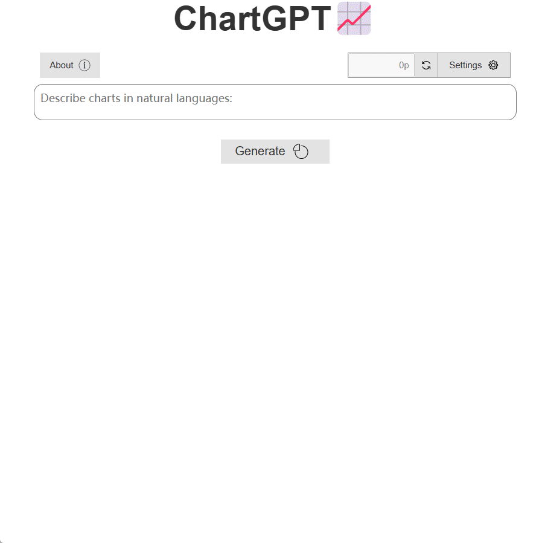

<p align="center">
    
</p>
<h1 align="center">ChartGPT</h1>
<p align="center">
    <em>使用自然语言生成Echarts图表</em>
</p>

## What it does



## How to use

根目录中新建`.env`文件：

```
API_KEY= "sk-xxxxxxxx"
```

1.创建一个折线图，横坐标['Mon', 'Tue', 'Wed', 'Thu', 'Fri', 'Sat', 'Sun']，纵坐标 [150, 230, 224, 218, 135, 147, 260] 

2.创建一个雷达图，数据 为[4200, 3000, 20000, 35000, 50000, 18000]，分别对应[Sales，Administration，Information Technology，Customer Support，Development,Marketing] 这几项内容

3.创建一个K线图，横坐标 ['2017-10-24', '2017-10-25', '2017-10-26', '2017-10-27']，纵坐标[[20, 34, 10, 38],[40, 35, 30, 50],[31, 38, 33, 44],[38, 15, 5, 42]]


## 参考

感谢

* [wishtodaya/ChartGenie: 一个可以使用自然语言生成图表的网站 ](https://github.com/wishtodaya/ChartGenie)的灵感提供与Prompt参考；

* [skyerhxx/COVID-19_Tracking: 基于Python+Flask+Echarts的疫情爬虫&数据可视化项目](https://github.com/skyerhxx/COVID-19_Tracking)中ajax和flask的数据交互参考；

* [API2d](https://api2d.com/r/186769)： 国内稳定的接口调用
